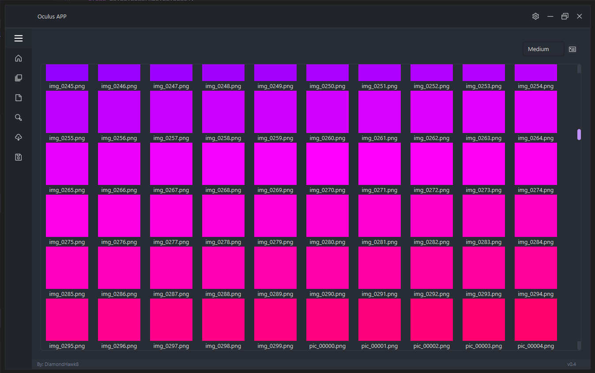
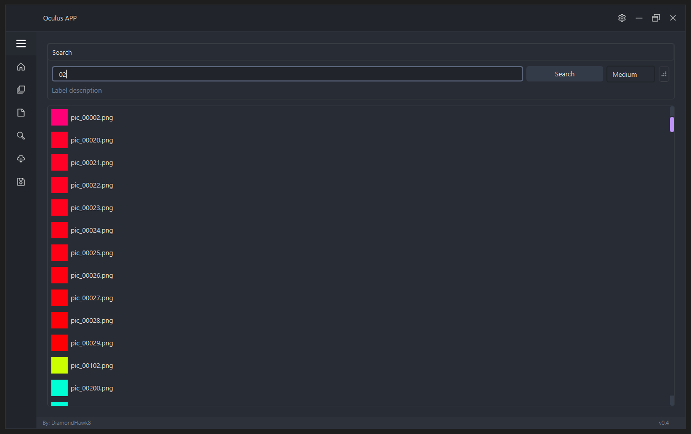
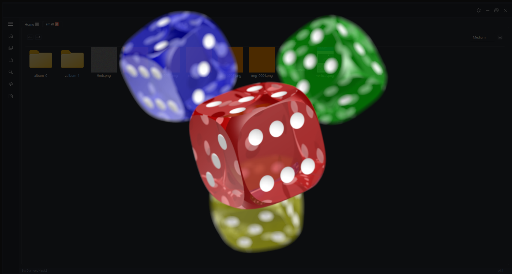

# Oculus

A **modern, high‑performance** desktop media manager and viewer built with **PySide6**.

---

## Project Status

| Phase                           | State       | Key Deliverables                                                                           |
|---------------------------------|-------------|--------------------------------------------------------------------------------------------|
| **1 — UI Skeleton**             | Completed   | Border‑less Dracula‑styled shell, custom window grips, page scaffolding                    |
| **2 — Core Metadata & Thumbnailing** | Completed   | Threaded folder scanner, SQLite schema (`media`, `tags`, `roots`), thumbnail cache         |
| **3 — Image Workflows** | In Progress | Tabs per folder, Browser‑style history, Fullscreen viewer (zoom + pan), Sorting, Variants, Metadata dialogs, Rename & drag‑move |
| **4 — Rich Media Support**      | Planned     | GIF playback (`QMovie`), Video playback (`QMediaPlayer` / PyAV), Audio (stretch goal)    |
| **5 — Polish&Packaging**        | Planned     | Session save/load, Commit/rollback move queue, Installers/portable build, Performance sweeps |
| **6 — Experimental/Cloud**      | Planned     | PostgreSQL backend, Cloud sync hooks, AI tagging suggestions                             |

---

## Feature Checklist

### **Completed**

- Asynchronous folder ingest (JPEG/PNG) with deep‑tree scan
- SQLite backend for paths, roots, tags & favourites
- Background thumbnail generation via `QThreadPool`
- Gallery view:
  - List/grid toggle, dynamic icon sizing
  - Browser‑like Back/Forward navigation
  - Tabs per sub‑folder (Ctrl+W, Ctrl+Tab, middle‑click open)
- Fullscreen image viewer with:
  - Fit/zoom (wheel, ±) & double‑click toggle
  - Left/Right navigation through current list
  - Basic click‑drag panning

### **In Progress(Phase 3)**

- **Search "Open in New Tab"** hook
- **Advanced sorting** (name, date, size, weight)
- **Variants**: cycle, collapse/expand in Gallery, visual stack indicator
- **Unified Metadata dialog** (Tags, Attributes, Zoom/Pan presets)
- **Zoom/Pan presets** with batch apply (image / folder / range / variants)
- **Rename & drag‑move** with commit/rollback + DB sync

### **Queued (Phase 4)**

- GIF playback (Qt `QMovie`)
- Video playback (`QMediaPlayer` / PyAV)
- Optional audio preview

### **Planned (Phase 5)**

- Session save/load (open tabs + per‑tab view state)
- Performance sweeps, memory guardrails
- Windows/MSIX + macOS dmg packaging

### **Planned (Phase 6)**

- PostgreSQL backend option
- Cloud sync / multi‑user hooks
- AI‑powered tagging & duplicate detection

---

## Screenshots *(Phase 2 — UI subject to polish)*

| Gallery                                      | Search                                  | Media View                             |
|----------------------------------------------|-----------------------------------------|----------------------------------------|
|     |  |  |

---

## Immediate Milestones

1. **Wrap Phase 3 core**  
   – Finish search‑to‑tab hook  
   – Ship variant indicator & cycle  
   – Land unified Metadata dialog  
   – Integrate rename & drag‑move commit queue
2. **Begin Phase 4**  
   – Drop‑in GIF playback  
   – Prototype video pipeline  
   – Add first performance benchmarks

---
